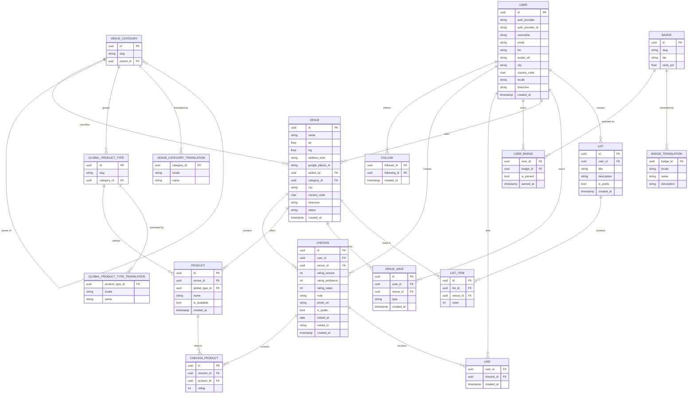

# Entity-Relationship Diagram

Entity-relationship diagram of the Obur data model.
Global-ready design: translation tables for i18n, UTC timestamps, ISO-standard field codes.

Last updated: August 2026

---

## Design Decisions

**Coordinate-based venue identity.** `lat` and `lng` are the primary identifier for a venue, not the name. Duplicate detection queries for existing venues within a 50-metre radius before allowing a new insert.

**CHECKIN and CHECKIN_PRODUCT are separated.** A single check-in can contain multiple products (a user may eat several dishes in one visit). Each product carries its own rating. Venue-level ratings (service, ambiance, value) are stored once per check-in.

**Historical data is never deleted.** When a venue closes, `status` is set to `closed`. When a product is removed from a menu, `is_available` is set to `false`. Past check-ins remain visible as an archive.

**`visited_at` and `created_at` are separate fields.** A user may log a visit days after it occurred. Badge calculations use `visited_at`. The `visited_tz` field stores the IANA timezone at the time of visit for correct local-time calculations.

**Global-ready by design.** All timestamps stored in UTC. User-facing labels (`VENUE_CATEGORY`, `GLOBAL_PRODUCT_TYPE`, `BADGE`) live in separate translation tables keyed by BCP 47 locale. Adding a new language requires only new translation rows. `slug` fields provide language-independent references in code. `country_code` follows ISO 3166-1 alpha-2, `locale` follows BCP 47, `timezone` follows IANA tz database.

**Auth identity is provider-agnostic by field name.** `USER.auth_provider` ("clerk" today) and `auth_provider_id` (that provider's user ID) are deliberately not named after Clerk specifically. Application code outside the auth module never sees provider-specific types — only this pair of columns. Switching or adding an auth provider later needs new rows, not a rename migration. `UNIQUE (auth_provider, auth_provider_id)`.

**Translation tables over embedded strings.** `VENUE_CATEGORY`, `GLOBAL_PRODUCT_TYPE`, and `BADGE` store only a `slug` and metadata. All display names live in `*_TRANSLATION` tables. This avoids duplication and allows the same category system to serve multiple languages without schema changes.