# Entity-Relationship Diagram

Entity-relationship diagram of the Obur data model.
Global-ready design: translation tables for i18n, UTC timestamps, ISO-standard field codes.

Last updated: August 2026

```mermaid
erDiagram
  USER {
    uuid id PK
    string auth_provider
    string auth_provider_id
    string display_name
    string username
    string email
    string bio
    string avatar_url
    string city
    char country_code
    string locale
    string timezone
    string role
    string status
    timestamp created_at
  }
  FOLLOW {
    uuid follower_id FK
    uuid following_id FK
    timestamp created_at
  }
  CLOSE_FRIEND {
    uuid user_id FK
    uuid friend_id FK
    timestamp created_at
  }
  MUTE {
    uuid user_id FK
    uuid muted_id FK
    timestamp created_at
  }
  BLOCK {
    uuid blocker_id FK
    uuid blocked_id FK
    timestamp created_at
  }
  VENUE_CATEGORY {
    uuid id PK
    string slug
    uuid parent_id FK
  }
  VENUE_CATEGORY_TRANSLATION {
    uuid category_id FK
    string locale
    string name
  }
  VENUE {
    uuid id PK
    string name
    float lat
    float lng
    geography location
    string address_note
    string google_places_id
    uuid added_by FK
    uuid category_id FK
    string city
    string district
    char country_code
    string timezone
    bool is_active
    bool is_verified
    bool is_suspended
    timestamp created_at
  }
  VENUE_SAVE {
    uuid id PK
    uuid user_id FK
    uuid venue_id FK
    string type
    string visibility
    timestamp created_at
  }
  CHECKIN {
    uuid id PK
    uuid user_id FK
    uuid venue_id FK
    int rating_taste
    int rating_service
    int rating_ambiance
    int rating_value
    string note
    string photo_url
    string visibility
    date visited_at
    string visited_tz
    timestamp deleted_at
    string idempotency_key
    timestamp created_at
  }
  CHECKIN_DRAFT {
    uuid id PK
    uuid user_id FK
    uuid venue_id FK
    int rating_taste
    int rating_service
    int rating_ambiance
    int rating_value
    string note
    string photo_url
    date visited_at
    timestamp updated_at
    timestamp created_at
  }
  CHECKIN_LIKE {
    uuid user_id FK
    uuid checkin_id FK
    timestamp created_at
  }
  CHECKIN_BOOKMARK {
    uuid user_id FK
    uuid checkin_id FK
    timestamp created_at
  }
  CHECKIN_MENTION {
    uuid id PK
    uuid checkin_id FK
    uuid mentioned_user_id FK
    timestamp created_at
  }
  HASHTAG {
    uuid id PK
    string tag
    timestamp created_at
  }
  CHECKIN_HASHTAG {
    uuid checkin_id FK
    uuid hashtag_id FK
  }
  LIST_HASHTAG {
    uuid list_id FK
    uuid hashtag_id FK
  }
  LIST {
    uuid id PK
    uuid user_id FK
    string title
    string description
    string visibility
    timestamp created_at
  }
  LIST_ITEM {
    uuid id PK
    uuid list_id FK
    uuid venue_id FK
    string position
    timestamp created_at
  }
  LIST_LIKE {
    uuid user_id FK
    uuid list_id FK
    timestamp created_at
  }
  LIST_BOOKMARK {
    uuid user_id FK
    uuid list_id FK
    timestamp created_at
  }
  NOTIFICATION {
    uuid id PK
    uuid user_id FK
    string type
    uuid actor_id FK
    string target_type
    uuid target_id
    timestamp read_at
    timestamp created_at
  }
  BADGE {
    uuid id PK
    string slug
    string tier
    float rarity_pct
  }
  BADGE_TRANSLATION {
    uuid badge_id FK
    string locale
    string name
    string description
  }
  USER_BADGE {
    uuid user_id FK
    uuid badge_id FK
    bool is_pinned
    timestamp earned_at
  }
  CONTENT_REPORT {
    uuid id PK
    uuid reporter_id FK
    string target_type
    uuid target_id
    string reason
    string status
    uuid resolved_by FK
    timestamp resolved_at
    timestamp created_at
  }
  VENUE_REPORT {
    uuid id PK
    uuid reporter_id FK
    uuid venue_id FK
    string reason
    string status
    uuid resolved_by FK
    timestamp resolved_at
    timestamp created_at
  }

  USER ||--o{ FOLLOW : "follows"
  USER ||--o{ CLOSE_FRIEND : "curates"
  USER ||--o{ MUTE : "mutes"
  USER ||--o{ BLOCK : "blocks"
  USER ||--o{ CONTENT_REPORT : "files"
  USER ||--o{ VENUE_REPORT : "files"
  VENUE ||--o{ VENUE_REPORT : "reported by"
  USER ||--o{ CHECKIN : "creates"
  USER ||--o{ CHECKIN_DRAFT : "drafts"
  VENUE ||--o{ CHECKIN_DRAFT : "may reference"
  USER ||--o{ CHECKIN_LIKE : "likes"
  USER ||--o{ CHECKIN_BOOKMARK : "bookmarks"
  USER ||--o{ LIST_LIKE : "likes"
  USER ||--o{ LIST_BOOKMARK : "bookmarks"
  USER ||--o{ NOTIFICATION : "receives"
  USER ||--o{ USER_BADGE : "earns"
  USER ||--o{ VENUE : "adds"
  USER ||--o{ VENUE_SAVE : "saves"
  USER ||--o{ LIST : "creates"
  FOLLOW ||--o| CLOSE_FRIEND : "required by"
  VENUE ||--o{ CHECKIN : "contains"
  VENUE ||--o{ VENUE_SAVE : "saved by"
  VENUE ||--o{ LIST_ITEM : "listed in"
  VENUE_CATEGORY ||--o{ VENUE : "classifies"
  VENUE_CATEGORY ||--o{ VENUE_CATEGORY : "parent of"
  VENUE_CATEGORY ||--o{ VENUE_CATEGORY_TRANSLATION : "translated by"
  CHECKIN ||--o{ CHECKIN_LIKE : "receives"
  CHECKIN ||--o{ CHECKIN_BOOKMARK : "receives"
  CHECKIN ||--o{ CHECKIN_MENTION : "mentions in"
  USER ||--o{ CHECKIN_MENTION : "is mentioned via"
  CHECKIN ||--o{ CHECKIN_HASHTAG : "tagged with"
  HASHTAG ||--o{ CHECKIN_HASHTAG : "applied to"
  HASHTAG ||--o{ LIST_HASHTAG : "applied to"
  LIST ||--o{ LIST_ITEM : "contains"
  LIST ||--o{ LIST_LIKE : "receives"
  LIST ||--o{ LIST_BOOKMARK : "receives"
  LIST ||--o{ LIST_HASHTAG : "tagged with"
  BADGE ||--o{ USER_BADGE : "awarded as"
  BADGE ||--o{ BADGE_TRANSLATION : "translated by"
```

---

## Design Decisions

**Coordinate-based venue identity, with a stronger identity signal layered on top where available.** `lat` and `lng` are the primary identifier for a venue, not the name. Duplicate detection is two layers, not one (see [ADR-0009](../adr/0009-venue-discovery-enrichment.md)): an exact `google_places_id` match (unique where not null) resolves silently to the existing venue with no prompt; everything else falls back to the original 50-metre radius check, which still prompts "did you mean this one?" `district` is required for every venue from ADR-0009 forward (nullable only for pre-existing rows), since `city` alone can't scope discovery/badges/rankings to something like "Kadıköy." `is_verified` is a separate, purely cosmetic signal ("this location definitely exists here") that never affects ranking or discoverability — set via a Google-match-plus-N-check-ins path, or a check-ins-plus-admin-review path where both conditions are required, never a review-everything model.

**No user edits a venue directly, not even whoever added it — every correction is report-driven, admin-only.** `is_active` and `is_suspended` replace what was originally a single `status` string: `is_active = false` is a closed business, still shown transparently as an archived record; `is_suspended = true` is an admin moderation action that hides the venue entirely, its own page returning a generic "not found" rather than an explanation — consistent with how a blocked profile behaves. Both flip only through an admin acting on a report, never directly by any user, on a real abuse precedent from an unrelated app's community-edit feature.

**`VENUE.location` is database-generated, not application-maintained.** It's a PostGIS `geography` computed from `lat`/`lng` via `GENERATED ALWAYS AS (...) STORED`, so it can never drift out of sync with the columns it's derived from. It backs the 50-metre duplicate check (`ST_DWithin`).

**Venue name search uses a `pg_trgm` trigram index on `name`, not full-text search.** See [ADR-0003](../adr/0003-trigram-venue-name-search.md): trigram similarity is language-agnostic and typo-tolerant, which a language-specific `tsvector` config isn't — a requirement given venue names appear in many languages and Obur's global-expansion plans.

**A check-in rates four things about the venue and nothing beneath it.** `rating_taste`, `rating_service`, `rating_ambiance`, and `rating_value` are all required. An earlier model added a per-item layer (`PRODUCT`, `GLOBAL_PRODUCT_TYPE`, `CHECKIN_PRODUCT`) so each dish carried its own rating; it was removed in [ADR-0011](../adr/0011-drop-product-layer-four-venue-criteria.md) because no individual item could reach the rating floor below at this platform's scale. `rating_taste` was added in the same change — it is now the only field measuring the food itself — and `rating_value` was redefined to mean value for money, the one price dimension, since "the payoff of the overall experience" overlapped the other three once each was rated separately.

**There is one aggregate score, at the venue level.** It pools all four rating fields from every `public` check-in at that venue into a single number shown at the top of the venue's page — one combined "how was visiting this place," matching real-world precedent (Google Maps, Yelp) rather than several scores competing for attention; the four criteria are shown individually beneath it. Because every check-in contributes exactly four values, every check-in weighs the same — an earlier two-level design had to accept that a check-in rating more items carried proportionally more influence, and that asymmetry disappeared with the product layer. The score computes a 95%-confidence lower bound on the mean (the same principle behind the Wilson score interval Reddit/Yelp use, chosen over a Bayesian/IMDb-style approach specifically because it stays anchored to the pool's own data instead of diluting toward an unrelated platform-wide average) rather than a raw mean, below a 10-rating floor beneath which no label is shown at all.

**Historical data is never deleted.** When a venue closes, `is_active` is set to `false` — it stays visible, shown transparently as inactive, not hidden or removed. Past check-ins remain visible as an archive. A check-in itself is never truly deleted either — `CHECKIN.deleted_at` marks it removed without dropping the row, so a badge or aggregate already computed from it can't be retroactively corrupted. Only a separate admin action can permanently purge one, for moderation/takedown cases.

**A check-in's own fields are editable; its rated products are not.** See [ADR-0005](../adr/0005-checkin-fields-editable-products-immutable.md): fixing a wrong product or rating means deleting the check-in and creating a new one, not editing it in place — verified against how comparable apps (Untappd) handle this.

**`CHECKIN_DRAFT` is a separate table from `CHECKIN`, not an `is_draft` flag on it.** A flag would require every aggregate-rating, badge, and feed query to remember to filter it out, forever — this platform has already hit that exact failure mode twice (an existence-leak and a stale-visibility bug, both "a query somewhere forgot to filter"). A separate table makes a draft leaking into rating/badge/feed logic structurally impossible instead of a matter of developer discipline. It's server-synced (not device-local) so a draft started on mobile is resumable on web, the same cross-device-consistency standard `NOTIFICATION.read_at` already set. On submit, its data becomes a real `CHECKIN` row (via `idempotency_key`, guarding against duplicate creation on a retried submission) and the draft row is deleted.

**`visibility` is a shared three-tier field (`public` / `close_friends` / `private`) on `CHECKIN`, `LIST`, and `VENUE_SAVE` alike.** See [ADR-0006](../adr/0006-three-tier-visibility-and-close-friends.md), which supersedes [ADR-0004](../adr/0004-checkin-visibility-single-toggle.md)'s single boolean: a "followers-only" tier was considered and rejected, since Obur's one-directional, no-approval follow model gives it no real access-control meaning — anyone can grant themselves "follower" status just by following. `close_friends` is a manually curated allow-list instead (see `CLOSE_FRIEND` below), modeled on Letterboxd's real-world equivalent. `CHECKIN`/`LIST` default to `public`; `VENUE_SAVE` defaults to `private` — saving a venue is a personal tracking action first.

**`CLOSE_FRIEND` requires an existing `FOLLOW` row and is revoked automatically when that follow is removed.** `(friend_id, user_id)` is a composite foreign key into `FOLLOW.(follower_id, following_id)` with `ON DELETE CASCADE` — a single database constraint that both enforces "must currently be a follower to be added" and guarantees a close friend can never outlive the follow relationship it was built on. Not symmetric: `A` adding `B` as a close friend has no bearing on whether `B` has done the same for `A`.

**`MUTE` is deliberately not derived from `FOLLOW`, unlike `CLOSE_FRIEND`.** A user can mute anyone, followed or not — muting a stranger keeps their content out of Layer 2's algorithmic fill (§12) too, not just Layer 1. It's the lighter counterpart to blocking: one-directional, silent, and scoped to feed display only — the follow relationship, visibility, discoverability, likes, bookmarks, and notifications are all untouched. Where blocking is interpersonal-safety tooling, mute is a feed preference.

**`BLOCK` records direction even though it acts in both.** Same shape as `FOLLOW` — a composite key over two user references with a self-reference `CHECK` — and every visibility query asks whether a row exists in either direction, backed by an index on `blocked_id` for the reverse lookup. A symmetric representation would have been simpler and was rejected: only the blocker may unblock, and the blocked person must never learn a block exists, and both of those need to know which way it runs. Cascades on both sides when either account is deleted — unlike a report, a block has no archival value once one party is gone. See [ADR-0010](../adr/0010-blocking-and-reporting-schema.md).

**Reports are two tables split by concern, not three split by target.** `CONTENT_REPORT` covers check-ins and profiles; `VENUE_REPORT` covers venues. They are separated because their reason vocabularies, admin resolutions, and urgency all differ — a harassment report is time-sensitive harm, a wrong address is not — and because splitting lets each hold the strongest integrity it honestly can. `VENUE_REPORT.venue_id` is a real foreign key, since a `VENUE` row is never deleted (`is_active` / `is_suspended` instead). `CONTENT_REPORT.target_id` deliberately is not, for the same reason `NOTIFICATION.target_id` isn't: a check-in can be permanently purged by an admin and a `USER` row is destroyed outright by account deletion, so a real foreign key would force a choice between cascading away the record of why content was removed and blocking the purge itself. Both tables keep `reporter_id` with `ON DELETE SET NULL` — a report is a moderation record that outlives its reporter's account, the same treatment `VENUE.added_by` already has. See [ADR-0010](../adr/0010-blocking-and-reporting-schema.md).

**Likes are a visible signal; bookmarks are always private — kept as separate tables, not a shared table with a mode flag.** `CHECKIN_LIKE`/`LIST_LIKE` are public counts anyone can see (subject to the target's own visibility); `CHECKIN_BOOKMARK`/`LIST_BOOKMARK` are personal save-for-later notes nobody but the bookmarker can ever see — there is deliberately no "how many bookmarked this" count anywhere. See [ADR-0006](../adr/0006-three-tier-visibility-and-close-friends.md). Liking or bookmarking something is only possible if the actor can already see it.

**`CHECKIN_MENTION` only exists between mutual followers, and never overrides the mentioned check-in's own visibility.** A structured table, not text parsed out of `CHECKIN.note` at render time, so mention creation can enforce the mutual-follow requirement, trigger a notification the same way `CHECKIN_LIKE` does, and get purged retroactively the moment the two people block each other — the same cleanup already applied to likes, bookmarks, and notifications. Requiring mutual following (not just "the author follows them," which the one-directional `FOLLOW` model would otherwise allow unilaterally) keeps mentions inside an already-established two-sided relationship, avoiding the unwanted-attention vector the platform's no-comment/no-DM stance already exists to prevent. Being mentioned in a `private`/`close_friends` check-in notifies, but doesn't grant access to see it — extending visibility this way would be a backdoor around the same authorization system kept airtight everywhere else in this document.

**`HASHTAG` is free text, shared across `CHECKIN` and `LIST` via join tables, capped at 5 per item at the application layer.** No relationship requirement, unlike a mention — a hashtag doesn't target a person. `HASHTAG.tag` is stored in a Turkish-aware normalized form, not a naive lowercase: Turkish's dotted/dotless İ-I distinction means a locale-naive case-fold can silently produce two different rows for what should be the same tag, the same class of subtle text bug `LIST_ITEM.position`'s `COLLATE "C"` requirement already caught (ADR-0007). The 5-item cap exists to keep hashtag-based discovery meaningful, not to limit expression — an unbounded list would let one post crowd dozens of unrelated discovery pages.

**`LIST_ITEM.position` is a fractional-indexing string, not an integer `order`.** See [ADR-0007](../adr/0007-fractional-indexing-for-list-ordering.md): inserting, moving, or removing an item writes only that one row, never renumbering neighbors — and critically requires `COLLATE "C"` (byte-wise ordering), since the algorithm's correctness silently breaks under a locale-aware default collation.

**`NOTIFICATION` is created synchronously, in the same transaction as the event it describes — no queue, no worker.** See [ADR-0008](../adr/0008-synchronous-in-app-notifications.md). `read_at` lives on the backend row, not per-device, so read-state is automatically consistent across every client. `target_type`/`target_id` is deliberately not a real foreign key, unlike `CHECKIN_LIKE`/`CHECKIN_BOOKMARK` — a notification is a transient record, not data whose own correctness depends on the target still existing.

**Authorization has two layers: ownership, and an admin override.** A user may act on their own resources; `USER.role = 'admin'` may act on anyone's. The same rule — and the same `can_view` function — governs `CHECKIN`, `LIST`, and `VENUE_SAVE` visibility checks alike. `role` is never settable through any user-facing endpoint or the Clerk webhook — the first admin account is set directly in the database, by hand.

**`display_name` and `username` are two separate fields, not one.** `display_name` is what's shown everywhere and can be changed freely, with no uniqueness constraint. `username` is the unique handle that search, mentions, and profile URLs key off of — edits to it are rate-limited, since an unrestricted handle is an impersonation vector in a way a display name isn't.

**`USER.status` (`active | frozen | suspended`) is standing, kept separate from `role`, which is permission.** `frozen` is self-service and reversible — a user freezes their own account and reactivates it just by logging back in. `suspended` is admin-only, set only by resolving a report (see the blocking/reporting decision above), and never user-reversible. Neither value is reachable by the other actor — a user can't suspend anyone, an admin doesn't need to freeze accounts.

**Account deletion is permanent, not a `status` value or a soft-delete — the one deliberate exception to "historical data is never deleted."** It purges every check-in (and its `CHECKIN_LIKE`/`CHECKIN_BOOKMARK`/`CHECKIN_MENTION` rows), every list and `LIST_ITEM`, and every `VENUE_SAVE` belonging to the account — reusing the same permanent-purge mechanism an admin takedown already needed for individual check-ins, just user-triggered instead. A venue the account added is not personal content, so it isn't deleted with it: `VENUE.added_by` is set to `NULL` (`ON DELETE SET NULL`) rather than left dangling or cascaded. Chosen over a softer "anonymize but keep the content" approach — the model blocking uses for display only — because once a user asks to be forgotten, the data itself should be gone, not just its attribution.

**`visited_at` and `created_at` are separate fields.** A user may log a visit days after it occurred. Badge calculations use `visited_at`. The `visited_tz` field stores the IANA timezone at the time of visit for correct local-time calculations.

**Global-ready by design.** All timestamps stored in UTC. User-facing labels (`VENUE_CATEGORY`, `BADGE`) live in separate translation tables keyed by BCP 47 locale. Adding a new language requires only new translation rows. `slug` fields provide language-independent references in code. `country_code` follows ISO 3166-1 alpha-2, `locale` follows BCP 47, `timezone` follows IANA tz database.

**Auth identity is provider-agnostic by field name.** `USER.auth_provider` ("clerk" today) and `auth_provider_id` (that provider's user ID) are deliberately not named after Clerk specifically. Application code outside the auth module never sees provider-specific types — only this pair of columns. Switching or adding an auth provider later needs new rows, not a rename migration. `UNIQUE (auth_provider, auth_provider_id)`.

**Translation tables over embedded strings.** `VENUE_CATEGORY` and `BADGE` store only a `slug` and metadata. All display names live in `*_TRANSLATION` tables. This avoids duplication and allows the same category system to serve multiple languages without schema changes.

**`VENUE.category_id` is the platform's only classification dimension.** With the product layer gone it backs three separate readers — Discover's filters, the feed's Layer-2 taste-overlap signal, and a user's own "best per category" history — so its granularity sets a ceiling on how specific all three can be. Unlike the item catalog it replaced, it stays tractable: venue types are a bounded set, a venue is created rarely rather than chosen on every check-in, the parent category is always a valid fallback so nothing blocks, and a wrong category is admin-correctable through the same venue report path as any other field.