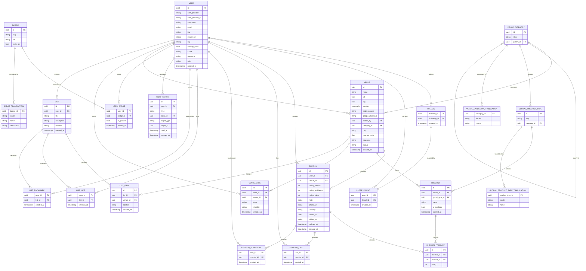

# Entity-Relationship Diagram

Entity-relationship diagram of the Obur data model.
Global-ready design: translation tables for i18n, UTC timestamps, ISO-standard field codes.

Last updated: August 2026

---

## Design Decisions

**Coordinate-based venue identity.** `lat` and `lng` are the primary identifier for a venue, not the name. Duplicate detection queries for existing venues within a 50-metre radius before allowing a new insert.

**`VENUE.location` is database-generated, not application-maintained.** It's a PostGIS `geography` computed from `lat`/`lng` via `GENERATED ALWAYS AS (...) STORED`, so it can never drift out of sync with the columns it's derived from. It backs the 50-metre duplicate check (`ST_DWithin`).

**Venue name search uses a `pg_trgm` trigram index on `name`, not full-text search.** See [ADR-0003](../adr/0003-trigram-venue-name-search.md): trigram similarity is language-agnostic and typo-tolerant, which a language-specific `tsvector` config isn't — a requirement given venue names appear in many languages and Obur's global-expansion plans.

**CHECKIN and CHECKIN_PRODUCT are separated.** A single check-in can contain multiple products (a user may eat several dishes in one visit). Each product carries its own rating. Venue-level ratings (service, ambiance, value) are stored once per check-in.

**Historical data is never deleted.** When a venue closes, `status` is set to `closed`. When a product is removed from a menu, `is_available` is set to `false`. Past check-ins remain visible as an archive. A check-in itself is never truly deleted either — `CHECKIN.deleted_at` marks it removed without dropping the row, so a badge or aggregate already computed from it can't be retroactively corrupted. Only a separate admin action can permanently purge one, for moderation/takedown cases.

**A check-in's own fields are editable; its rated products are not.** See [ADR-0005](../adr/0005-checkin-fields-editable-products-immutable.md): fixing a wrong product or rating means deleting the check-in and creating a new one, not editing it in place — verified against how comparable apps (Untappd) handle this.

**`visibility` is a shared three-tier field (`public` / `close_friends` / `private`) on `CHECKIN`, `LIST`, and `VENUE_SAVE` alike.** See [ADR-0006](../adr/0006-three-tier-visibility-and-close-friends.md), which supersedes [ADR-0004](../adr/0004-checkin-visibility-single-toggle.md)'s single boolean: a "followers-only" tier was considered and rejected, since Obur's one-directional, no-approval follow model gives it no real access-control meaning — anyone can grant themselves "follower" status just by following. `close_friends` is a manually curated allow-list instead (see `CLOSE_FRIEND` below), modeled on Letterboxd's real-world equivalent. `CHECKIN`/`LIST` default to `public`; `VENUE_SAVE` defaults to `private` — saving a venue is a personal tracking action first.

**`CLOSE_FRIEND` requires an existing `FOLLOW` row and is revoked automatically when that follow is removed.** `(friend_id, user_id)` is a composite foreign key into `FOLLOW.(follower_id, following_id)` with `ON DELETE CASCADE` — a single database constraint that both enforces "must currently be a follower to be added" and guarantees a close friend can never outlive the follow relationship it was built on. Not symmetric: `A` adding `B` as a close friend has no bearing on whether `B` has done the same for `A`.

**Likes are a visible signal; bookmarks are always private — kept as separate tables, not a shared table with a mode flag.** `CHECKIN_LIKE`/`LIST_LIKE` are public counts anyone can see (subject to the target's own visibility); `CHECKIN_BOOKMARK`/`LIST_BOOKMARK` are personal save-for-later notes nobody but the bookmarker can ever see — there is deliberately no "how many bookmarked this" count anywhere. See [ADR-0006](../adr/0006-three-tier-visibility-and-close-friends.md). Liking or bookmarking something is only possible if the actor can already see it.

**`LIST_ITEM.position` is a fractional-indexing string, not an integer `order`.** See [ADR-0007](../adr/0007-fractional-indexing-for-list-ordering.md): inserting, moving, or removing an item writes only that one row, never renumbering neighbors — and critically requires `COLLATE "C"` (byte-wise ordering), since the algorithm's correctness silently breaks under a locale-aware default collation.

**`NOTIFICATION` is created synchronously, in the same transaction as the event it describes — no queue, no worker.** See [ADR-0008](../adr/0008-synchronous-in-app-notifications.md). `read_at` lives on the backend row, not per-device, so read-state is automatically consistent across every client. `target_type`/`target_id` is deliberately not a real foreign key, unlike `CHECKIN_LIKE`/`CHECKIN_BOOKMARK` — a notification is a transient record, not data whose own correctness depends on the target still existing.

**Authorization has two layers: ownership, and an admin override.** A user may act on their own resources; `USER.role = 'admin'` may act on anyone's. The same rule — and the same `can_view` function — governs `CHECKIN`, `LIST`, and `VENUE_SAVE` visibility checks alike. `role` is never settable through any user-facing endpoint or the Clerk webhook — the first admin account is set directly in the database, by hand.

**`visited_at` and `created_at` are separate fields.** A user may log a visit days after it occurred. Badge calculations use `visited_at`. The `visited_tz` field stores the IANA timezone at the time of visit for correct local-time calculations.

**Global-ready by design.** All timestamps stored in UTC. User-facing labels (`VENUE_CATEGORY`, `GLOBAL_PRODUCT_TYPE`, `BADGE`) live in separate translation tables keyed by BCP 47 locale. Adding a new language requires only new translation rows. `slug` fields provide language-independent references in code. `country_code` follows ISO 3166-1 alpha-2, `locale` follows BCP 47, `timezone` follows IANA tz database.

**Auth identity is provider-agnostic by field name.** `USER.auth_provider` ("clerk" today) and `auth_provider_id` (that provider's user ID) are deliberately not named after Clerk specifically. Application code outside the auth module never sees provider-specific types — only this pair of columns. Switching or adding an auth provider later needs new rows, not a rename migration. `UNIQUE (auth_provider, auth_provider_id)`.

**Translation tables over embedded strings.** `VENUE_CATEGORY`, `GLOBAL_PRODUCT_TYPE`, and `BADGE` store only a `slug` and metadata. All display names live in `*_TRANSLATION` tables. This avoids duplication and allows the same category system to serve multiple languages without schema changes.